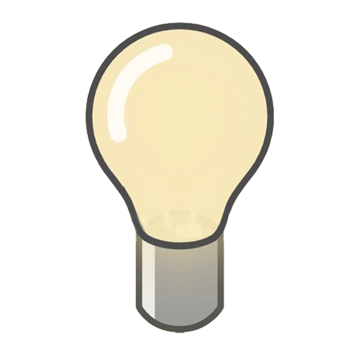

# YouTube Focus Mode 🎯

A Chrome extension designed to help you stay focused while browsing YouTube by intelligently filtering distracting content based on customizable keywords.



## ✨ Features

- **🎯 Smart Content Filtering**: Hide videos containing distracting keywords
- **🔧 Customizable Keywords**: Set up blacklisted and distraction keywords
- **🌓 Focus Mode Toggle**: Enable/disable filtering with a simple click
- **🎨 Beautiful UI**: Adaptive interface that changes with focus mode
- **💾 Persistent Settings**: Your preferences are saved across browser sessions
- **⚡ Real-time Processing**: Automatically processes new content as you browse

## 🚀 How It Works

### Keyword Types

- **Blacklisted Keywords**: Content containing these keywords will **always** be hidden, regardless of focus mode status
- **Distraction Keywords**: Content containing these keywords will only be hidden when **focus mode is enabled**

### Focus Mode Toggle

When enabled, the extension:
- Filters content based on both blacklisted and distraction keywords
- Provides visual cues to help maintain focus
- Creates a cleaner, more productive YouTube experience

## 📦 Installation

### From Source

1. Clone this repository:
   ```bash
   git clone https://github.com/aadil-sengupta/YtFocusMode.git
   cd YtFocusMode/focusMode
   ```

2. Install dependencies:
   ```bash
   npm install
   ```

3. Build the extension:
   ```bash
   npm run build
   ```

4. Load the extension in Chrome:
   - Open Chrome and go to `chrome://extensions/`
   - Enable "Developer mode" in the top right
   - Click "Load unpacked" and select the `dist` folder

## 🎛️ Usage

### Setting Up Keywords

1. Click the extension icon in your browser toolbar
2. Click "Settings" to open the configuration page
3. Navigate to the "Content Filtering" tab
4. Add your keywords:
   - **Distraction Keywords**: Entertainment, funny, viral content
   - **Blacklisted Keywords**: Content you never want to see

### Managing Websites

1. Go to the "Websites" tab in settings
2. **youtube.com** is enabled by default and cannot be removed
3. Additional website support is coming soon

### Using Focus Mode

- Click the extension icon to toggle focus mode on/off
- When enabled: Both blacklisted and distraction keywords are filtered
- When disabled: Only blacklisted keywords are filtered

## 🛠️ Tech Stack

- **Frontend**: React 19 + TypeScript
- **Build Tool**: Vite
- **Extension Framework**: CRXJS
- **Styling**: Inline styles with HSL color system
- **Storage**: Chrome Extension Storage API
- **Animations**: GSAP

## 📁 Project Structure

```
focusMode/
├── src/
│   ├── components/          # Reusable UI components
│   │   ├── bulb.tsx        # Animated bulb component
│   │   └── settingsModal.tsx
│   ├── contexts/           # React contexts for state management
│   │   ├── FocusModeContext.tsx
│   │   └── KeywordsContext.tsx
│   ├── content/            # Content script
│   │   └── main.tsx        # YouTube content filtering logic
│   ├── popup/              # Extension popup
│   │   ├── App.tsx
│   │   └── main.tsx
│   └── settings/           # Settings page
│       └── main.tsx        # Full settings interface
├── public/
│   └── logo.png
├── manifest.config.ts      # Extension manifest configuration
└── package.json
```

## 🔧 Development

### Prerequisites

- Node.js 18+
- npm or yarn

### Setup

1. Install dependencies:
   ```bash
   npm install
   ```

2. Start development server:
   ```bash
   npm run dev
   ```

3. Build for production:
   ```bash
   npm run build
   ```

### Development Features

- **Hot Reload**: Changes are automatically reflected in the extension
- **TypeScript**: Full type safety throughout the codebase
- **Modern React**: Uses React 19 with hooks and context
- **Vite**: Fast build tool with excellent DX

## 🎨 Design Philosophy

- **Minimalist UI**: Clean, distraction-free interface
- **Adaptive Theming**: Colors change based on focus mode state
- **Smooth Transitions**: All state changes are animated
- **Accessibility**: Proper contrast ratios and interactive elements

## 🔮 Roadmap

- [ ] **Custom Website Support**: Expand beyond YouTube to other video platforms
- [ ] **Advanced Filtering**: Category-based filtering, time-based rules
- [ ] **Analytics**: Track your focus time and filtered content
- [ ] **Sync Across Devices**: Cloud sync for settings
- [ ] **Whitelist Mode**: Show only specific types of content

## 🤝 Contributing

Contributions are welcome! Please feel free to submit a Pull Request.

1. Fork the repository
2. Create your feature branch (`git checkout -b feature/AmazingFeature`)
3. Commit your changes (`git commit -m 'Add some AmazingFeature'`)
4. Push to the branch (`git push origin feature/AmazingFeature`)
5. Open a Pull Request

## 📝 License

This project is licensed under the MIT License - see the [LICENSE](LICENSE) file for details.

## 🙏 Acknowledgments

- Built with love for productivity enthusiasts
- Inspired by the need for focused digital experiences
- Special thanks to the Chrome Extensions API team

---

**Made with ❤️ to help you stay focused and productive**